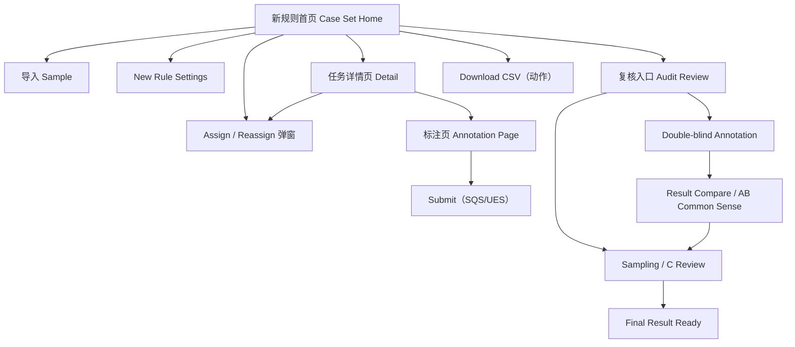

# PRD - ByteHi Manual Annotation Tool（New Rule）静态 Demo

## 1. 产品概述

ByteHi 人工标注工具 New Rule 版的静态前端 Demo，用于展示标注工具如何从旧规则（GE Rate / P-Q-I）适配到新规则（SQS 服务质量分 / UES 用户体验分）。

- 目标用户：智能客服产运、产品、设计、研发，用于对齐页面关系、核心交互、视觉风格与新规则呈现方式。
- 价值：让团队一眼看懂平台有哪些页面、每个页面做什么、用户如何在页面间流转，以及 SQS / UES 新规则在页面上的呈现。仅静态交互 + mock data，不接真实后端 / API / 上传 / 鉴权。

## 2. 核心功能

### 2.1 用户角色

Demo 不做真实登录鉴权，仅在 mock 数据与流程视图中体现角色概念：

| 角色 | 说明 | 在 Demo 中的体现 |
|------|------|------------------|
| Annotator (A/B) | 一线标注人 | 标注页打分、双盲标注 |
| QA Owner | 任务负责人 | Assign / Reassign 弹窗 |
| Reviewer (C) | 复核人 | Sampling / C Review、Final Result |

### 2.2 功能模块

按 **6 个核心页面 + 4 个流程视图 / 弹窗** 组织（下载 CSV 为动作，不算独立页面）：

1. **新规则首页 / Case Set Home**：Old/New Rule 切换、四个指标卡片、task 列表与主入口。
2. **导入 Sample**：Import from ByteHi / Upload CSV 两个入口、解析预览表。
3. **New Rule Settings**：Reason Templates、RCA Labels、Config Version / Effective Time。
4. **任务详情页 / Detail Session List**：某 task 下的 session 明细列表、筛选、入口。
5. **标注页 / Annotation Page**：左 evidence、右 SQS / UES 评分面板。
6. **复核入口 / Audit Review**：类 Meego/Jira 流程状态视图与下一步动作。

流程视图 / 弹窗：

1. **Assign / Reassign 弹窗**：分配 / 重分配 annotator / QA owner，支持平均分配。
2. **Double-blind Annotation 视图**：A/B 双盲 first-round 标注。
3. **Result Compare / AB Common Sense 视图**：A/B 差异对比并提交 AB 共识。
4. **Sampling / C Review 视图**：抽样 + C 复核，形成 final result。

### 2.3 页面详情

| 页面名称 | 模块名称 | 功能描述 |
|----------|----------|----------|
| 首页 Case Set Home | 规则切换 | 顶部 Old/New Rule 切换，默认选中 New Rule；Old Rule 不展开，仅表现新旧隔离 |
| 首页 Case Set Home | 指标卡片 | SQS Avg、UES Avg、SQS Pass Rate、QC Accuracy 四卡（来自 summary 层 mock） |
| 首页 Case Set Home | Task 列表 | 列：Task Name、Sample Name、Total/Annotated Cases、Progress、SQS Avg、UES Avg、QC Status、Actions(Detail/Assign/Audit/Download CSV) |
| 首页 Case Set Home | 主入口 | Import Sample、Upload CSV、Settings、Download CSV |
| 导入 Sample | 导入入口 | Import from ByteHi / Upload CSV 静态 tab，不做真实上传 |
| 导入 Sample | 解析预览表 | 字段：session id、session link、language、region、service subtype、knowledge source、problem type、annotator、status；系统字段仅核验，异常显示 data issue 提示 |
| 导入 Sample | SOP 提示 | 识别为 SOP 且缺 input/flow evidence 时显示 `input missing / not ready`，不阻塞 Skill/FAQ |
| Settings | Reason Templates | 按 SQS/UES 维度维护默认 reason 文案，Bot/Human 共用 |
| Settings | RCA Labels | 可选问题标签（wrong Skill/FAQ、wrong branch/action 等），不参与计分 |
| Settings | Config Version | 配置版本与生效时间（如 v2026.06.23 / Effective from 2026-06-23 10:00） |
| 任务详情页 | 结果表格 | 仅 New Rule 字段：Understanding Accuracy、Execution Correctness、Solution Adoption、SQS Total/Pass、Responsiveness、Service Efficiency、Expectation Achievement、Language Quality、UES Total、RCA Label、Status、Activity Log、Actions |
| 任务详情页 | 筛选 | Service Subtype、Knowledge Source、SQS Pass/No Pass、UES Dimension、Score、RCA Label、Annotator、QA Owner、Review Status |
| 任务详情页 | 行操作 | 点击 Session ID / Edit Annotation 进标注页；Assign QA 打开弹窗；Activity Log 抽屉 |
| Assign 弹窗 | 分配表单 | 标题 Assign Annotators；无 owner=Distribute，有 owner=Reassign；支持输入 QA name/email + 数量 + Average Distribution |
| Assign 弹窗 | Activity Log | 记录 operator email、时间、操作类型、变更字段（operator≠被分配 annotator） |
| 标注页 | Score Preview | SQS Total、UES Total、Pass/Fail |
| 标注页 | Session Information | 可折叠：Case、Session Link、Session/Task ID、Service Form、Channel、Entrance、Service Type/Subtype、Language、Region、Knowledge Source、Problem Type、Signal Priority |
| 标注页 | Evidence 区 | 左侧聊天气泡 message thread，User/Assistant 不同浅色背景，保留 message id，关键匹配 highlight |
| 标注页 | Bot/Human Result | Bot Result 含 SQS+UES；识别到 Bot to Human IM/Ticket 时展示 Human Result（结构一致，复用模板/校验） |
| 标注页 SQS | Understanding Accuracy | 3/2/1/0 按钮直选 + reasoning；展示 first query、matched source、negative signals |
| 标注页 SQS | Gating | UA=0 时 Execution Correctness 与 Solution Adoption 自动置 0、下游置灰并显示 auto-zero reason；改回非 0 恢复可编辑 |
| 标注页 SQS | Execution Correctness | 按 Knowledge Source 切换：Skill 判 route/branch/action(3/2/1/0)；FAQ 仅判正确完整(3/1/0)；SOP 显示 input missing/not ready |
| 标注页 SQS | Solution Adoption | Problem Type、Signal Priority、Score(3/1/0)、Reasoning |
| 标注页 UES | Gatekeeper | wrong language/offensive attitude/severe formatting/dead loop/other；命中则 UES Total=0、子维度置灰、要求 reason+RCA |
| 标注页 UES | 四维度 | Responsiveness(timestamp 预填可改)、Service Efficiency、Expectation Achievement、Language Quality |
| 复核入口 | 流程状态视图 | 类 Meego/Jira，展示 Single QC / Double-blind / Result Compare / AB Common Sense / Sampling-C Review / Final Result Ready 及下一步 |
| Result Compare | 三栏对比 | 左 Original Session/Evidence，中 A vs B diff（按维度），右 AB Common Sense form；三份记录均保留 |
| Sampling/C Review | 抽样 | scope(All/By Annotator/Service Subtype/Knowledge Source/SQS Fail/UES Dimension/RCA Label)、method(Percentage/Absolute) |
| Sampling/C Review | C 复核 | 三栏：左 Evidence，中 Annotator/AB 结果，右 C Decision/Final Review Result |
| CSV 导出 | 下载动作 | 两个 mock 下载按钮：annotation_summary.csv、annotation_data.csv |

## 3. 核心流程

用户从首页查看 New Rule 工作区指标与 task 列表；点击 Import Sample 导入并预览样本；进入 Settings 维护辅助配置；点击 task 的 Detail 查看 session 列表；点击 Session ID 进入标注页打分（SQS/UES，含 gating 与 gatekeeper 自动归零）；提交后通过 Audit 入口跟踪 QC 流程（Single QC 或 Double-blind → Result Compare → AB Common Sense → Sampling/C Review → Final Result），最终在首页/详情页 Download CSV。

## 4. 用户界面设计

### 4.1 设计风格

企业级 SaaS / 内部工具后台风格，信息密度偏高但层级清楚，非营销网站。

- 主色 / New Rule 主色：`#2563EB`（主按钮、当前 tab、New Rule badge）；浅蓝 `#EFF6FF`（选中态、提示卡片）。
- 状态色：Success/Pass `#16A34A`（浅 `#ECFDF3`）、Warning `#F59E0B`（浅 `#FFFBEB`）、Fail/Gatekeeper/Auto-zero `#DC2626`（浅 `#FEF2F2`）、Disabled/Not Ready `#9CA3AF`。
- 中性：页面背景 `#F7F8FA`、卡片 `#FFFFFF`、主文字 `#111827`、辅助文字 `#6B7280`、边框 `#E5E7EB`。
- 按钮：圆角矩形（约 6-8px），主按钮蓝底白字，次按钮白底描边。
- 字体：界面正文用清晰无衬线（如 Inter / IBM Plex Sans 一类），数字指标可用等宽以对齐；标题略加粗。字号正文 13-14px、指标数值 22-28px。
- 布局：浅灰背景 + 白色卡片，顶部 header，主体以表格、卡片、抽屉、右侧评分面板为主。状态用 badge/tag/banner 表达，不用大段文字。

### 4.2 页面设计概览

| 页面名称 | 模块名称 | UI 元素 |
|----------|----------|---------|
| 首页 | 指标卡片 | 4 个白卡，大号数值 + 维度标签 + 趋势/占比，蓝色高亮主指标 |
| 首页 | Task 表格 | 斑马纹表格、Progress 进度条、QC Status badge、行内 Actions 按钮组 |
| 导入 Sample | 入口 tab | 两个 tab/按钮（ByteHi / Upload CSV），下方解析预览表 + data issue 黄色提示 |
| Settings | 配置区块 | 三个卡片分区，可编辑模板列表、RCA 标签 chips、版本信息条 |
| 任务详情页 | 筛选栏 | 顶部多个下拉/标签筛选，下方密集结果表，SQS Pass 绿/红 badge |
| 标注页 | 左右分栏 | 左 60% 聊天气泡 evidence，右 40% 评分面板；3/2/1/0 分数按钮组；auto-zero 置灰 + 红色 reason banner |
| 标注页 | Score Preview | 顶部吸顶条，SQS/UES Total + Pass/Fail badge |
| 复核入口 | 流程视图 | 横向 stepper / 状态泳道，当前态高亮，下一步按钮 |
| Result Compare | 三栏 | 左 Evidence，中 A/B diff 高亮差异维度，右 AB Common Sense 表单 |
| Sampling/C Review | 抽样 + 三栏 | scope/method 控件、Estimated samples 计数、C Decision 三栏 |

### 4.3 响应式

桌面优先（内部工具），主要适配 1280-1920 宽度；窄屏下右侧评分面板可堆叠在 evidence 下方。不做移动端优先与过度装饰。

### 4.4 关键交互（静态 mock state）

点击首页 Detail 进任务详情；点击 Session ID 进标注页；标注页 Understanding Accuracy=0 触发 SQS auto-zero；UES Gatekeeper 命中触发 UES auto-zero；切换 hasHumanTransfer 显示/隐藏 Human Result；点击 Audit 进复核入口并在 Single QC / Double-blind / Result Compare / C Review 间切换状态；Download CSV 展示两个 mock 下载按钮。

## 5. 不做的内容

不接真实 ByteHi API、不做真实 CSV 上传解析、不做真实权限系统、不做真实保存/提交/下载、不实现复杂后端数据模型；不混用 Old Rule（不展示 GE Rate 主指标、P/Q/I 结果列、Intent/Quality/Interaction Reason 筛选）；Settings 不做权重/gating/Gatekeeper 开关与多套独立配置；不集成真实 Skill 小工具、不做实时 SOP 判断；不把 double-blind 写成 QC/Audit 模式；不做复杂动画与移动端优先。
