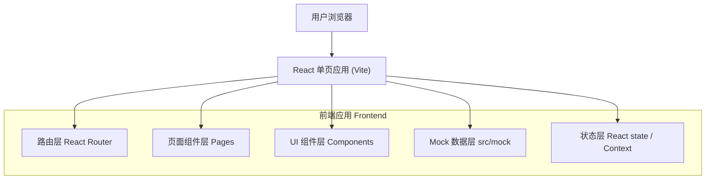

# 技术架构文档 - ByteHi Manual Annotation Tool（New Rule）静态 Demo

## 1. 架构设计

纯前端静态 Demo，无后端、无数据库。所有数据来自前端 mock 模块，状态由 React 组件状态管理。



## 2. 技术说明

- 前端：React@18 + TypeScript + tailwindcss@3 + Vite
- 初始化工具：vite（react-ts 模板）
- 路由：react-router-dom@6（页面间跳转）
- 图标：lucide-react（轻量图标，统一线性风格）
- 后端：无（None）
- 数据库：无；所有数据使用 `src/mock` 下的静态 mock data（取自 PRD demo prompt 的 Mock Data 章节）
- 交互：所有"提交 / 下载 / 上传"均为前端 mock state，不发真实请求；Download CSV 用前端生成的字符串触发浏览器下载或仅弹出提示

## 3. 路由定义

| 路由 | 用途 |
|------|------|
| /home | 新规则首页 Case Set Home（指标卡片 + task 列表，默认重定向到此） |
| /import | 导入 Sample（ByteHi / Upload CSV 入口 + 解析预览） |
| /settings | New Rule Settings（Reason Templates / RCA Labels / Config Version） |
| /task/:taskId | 任务详情页 Detail Session List |
| /annotate/:sessionId | 标注页 Annotation Page（左 evidence、右 SQS/UES） |
| /audit | 复核入口 Audit Review（流程状态视图） |
| /audit/compare/:sessionId | Result Compare / AB Common Sense 三栏视图 |
| /audit/review/:sessionId | Sampling / C Review 三栏视图 |

说明：Assign / Reassign 为弹窗组件（非路由）；Double-blind Annotation 视图复用标注页结构 + 流程状态；CSV 导出为按钮动作（非路由）。

## 4. API 定义

无后端，无真实 API。Demo 使用前端 mock 模块导出数据，结构如下（TypeScript 类型）：

```typescript
type QcStatus = "Review Pending" | "Final Result Ready" | "In Progress";

interface SummaryMetrics {
  annotatedCases: number;
  totalCases: number;
  sqsAvg: string;        // e.g. "2.43 / 3"
  uesAvg: string;        // e.g. "2.10 / 3"
  sqsPassRate: string;   // e.g. "78.5%"
  qcAccuracy: string;    // e.g. "92.0%"
  gatekeeperHitRate: string;
  avgReviewTime: string;
}

interface CaseSet {
  taskId: string;
  taskName: string;
  sampleName: string;
  totalCases: number;
  annotatedCases: number;
  progress: string;
  sqsAvg: string;
  uesAvg: string;
  qcStatus: QcStatus;
  ruleVersion: string;
}

type KnowledgeSource = "Skill" | "FAQ" | "SOP";
type ServiceSubtype = "Chatbot" | "Ticketbot";

interface SessionRow {
  sessionId: string;
  taskId: string;
  language: string;
  regionCode: string;
  serviceSubtype: ServiceSubtype;
  knowledgeSource: KnowledgeSource;
  problemType?: string;
  signalPriority?: string;
  qaOwner?: string;
  annotator?: string;
  understandingAccuracy?: number;
  executionCorrectness?: number;
  solutionAdoption?: number;
  sqsTotal?: number;
  sqsPass?: boolean;
  responsiveness?: number;
  serviceEfficiency?: number;
  expectationAchievement?: number;
  languageQuality?: number;
  uesTotal?: number;
  uesGatekeeperHit?: boolean;
  uesGatekeeperReason?: string;
  sopStatus?: string;          // "input missing / not ready"
  rcaLabel?: string;
  status: string;
  latestActivityLog: string;
}

interface ConversationMessage {
  id: number;
  role: "User" | "Assistant" | "System";
  type: "manual_input" | "llm_gen" | "evidence";
  text: string;
  matchedFaq?: string;
}

interface ReviewFlow {
  sessionId: string;
  annotationMode: "Single QC" | "Double Blind";
  currentState:
    | "Single QC"
    | "Double-blind Annotation"
    | "Result Compare"
    | "AB Common Sense"
    | "Sampling / C Review"
    | "Final Result Ready";
  aAnnotator?: string;
  bAnnotator?: string;
  aResultStatus?: string;
  bResultStatus?: string;
  mismatchStatus?: string;
  abCommonSenseStatus?: string;
  cReviewer?: string;
  finalResultStatus?: string;
}
```

## 5. 数据模型

无数据库。Mock 数据组织在 `src/mock/` 下，按 PRD demo prompt 第 5 章 mock 数据填充：

- `src/mock/summary.ts` → SummaryMetrics
- `src/mock/caseSets.ts` → CaseSet[]
- `src/mock/sessions.ts` → SessionRow[]
- `src/mock/conversation.ts` → ConversationMessage[]（按 sessionId 映射）
- `src/mock/reviewFlow.ts` → ReviewFlow[]
- `src/mock/settings.ts` → Reason Templates、RCA Labels、Config Version

## 6. 目录结构

```
draft/
  index.html
  package.json
  vite.config.ts
  tailwind.config.js
  postcss.config.js
  tsconfig.json
  src/
    main.tsx
    App.tsx                 # 路由 + 全局布局(Header/Sidebar)
    index.css               # tailwind + 主题 CSS 变量
    components/
      Layout.tsx
      Badge.tsx             # 状态 badge/tag
      ScoreButtons.tsx      # 3/2/1/0 分数按钮组
      AssignModal.tsx       # Assign/Reassign 弹窗
      ChatThread.tsx        # evidence 聊天气泡
      MetricCard.tsx
      Table.tsx
    pages/
      Home.tsx
      ImportSample.tsx
      Settings.tsx
      TaskDetail.tsx
      Annotation.tsx
      Audit.tsx
      ResultCompare.tsx
      CReview.tsx
    mock/
      summary.ts
      caseSets.ts
      sessions.ts
      conversation.ts
      reviewFlow.ts
      settings.ts
```
